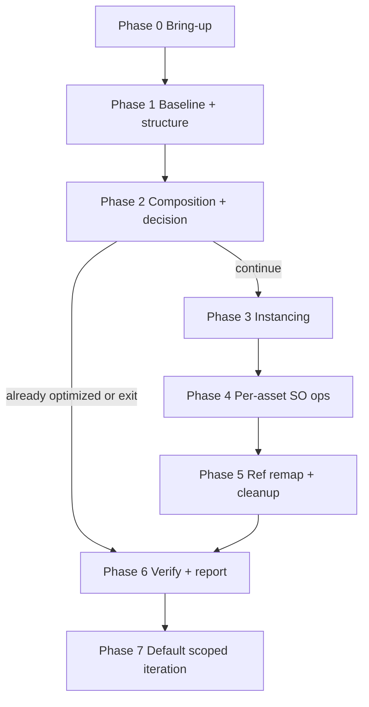

<!-- SPDX-FileCopyrightText: Copyright (c) 2026 NVIDIA CORPORATION & AFFILIATES. All rights reserved. -->
<!-- SPDX-License-Identifier: Apache-2.0 -->

# USD Performance Tuning Skill Map

> Compact navigation aid for the agent-facing catalog. Detailed phase
> choreography lives with the owning entry skill:
> `skills/omniverse-usd-performance-tuning/references/workflow.md`.

## Read me first

Use this map to enter the single public workflow skill and load only the next
necessary nested reference. Do not pre-read every reference.

- Start every public USD performance request in
  `omniverse-usd-performance-tuning`.
- Route validation-only requests to `usd-validation-runner`.
- Route runtime ambiguity to `setup-usd-performance-tuning` unless a runtime
  path is already verified.
- Route `omniverse://` targets to `omniverse-authentication` before probing.
- Route approved Scene Optimizer operation execution to `so-run-operations`.
- Resolve Scene Optimizer mechanics through upstream
  [usd-optimize](https://github.com/NVIDIA-omniverse/usd-optimize/) or the
  prebuilt `scene_optimizer_core_...release.zip` package using
  `$SCENE_OPTIMIZER_PACKAGE_ROOT`, then `$SO_HOME`. If no package root exists,
  use the package path, URL, or extracted root supplied by the user. Current
  public direct archive URLs are listed in
  `references/upstreams/usd-optimize.md`. Do not clone the source repo just to
  read SO operation docs.
- Read
  [the workflow reference](workflow.md)
  when the request needs the full Phase 0-7 optimization flow.
- Read
  [the report template](optimization-report/references/optimization-report-template.md)
  before Phase 0
  so every phase collects the fields needed by the final report.

## Catalog Surface

`skills.selected.txt` exposes exactly one public workflow skill.

| Selected skill | Purpose |
|---|---|
| `omniverse-usd-performance-tuning` | Top-level performance router and owner of the full workflow reference. |

## Nested References

These logical phases live under
`skills/omniverse-usd-performance-tuning/references/` and are loaded
only when their phase is reached:

| Reference | When loaded |
|---|---|
| `profile-stage` | Loaded by the workflow for baseline and after metrics. |
| `usd-hierarchy-dedupe-candidates` | Loaded when copied hierarchy or high mesh count suggests structure reuse. |
| `restructure-decision` | Loaded for the Phase 2e user-confirm gate. |
| `apply-restructure` | Loaded for Phase 2f hierarchy rewrite and Phase 5 reference remap. |
| `instancing-readiness` | Loaded when the workflow finds candidate instances. |
| `usd-edit-target-planner` | Loaded when edits need a safe authoring target. |
| `so-run-validators` | Loaded by validation routing for Scene Optimizer validator execution. |
| `so-interpret-validators` | Loaded to turn validator findings into operation recommendations. |
| `compare-profiles` | Loaded at Phase 6 to classify improvement, neutral, regression, or mixed outcomes. |
| `install-kit`, `install-so-via-kit`, `install-so-standalone`, `install-asset-validator-standalone` | Loaded only by setup dispatch. |
| `so-create-proxy` | Specialty user-request reference, not part of the main optimization flow. |

Validation command references are owned by
`skills/omniverse-usd-performance-tuning/references/usd-validation-runner/references/` rather than top-level
skills.

## Boundary Decisions

- `usd-structure-assessment` stays the broad composition, layer, asset-boundary,
  and reuse assessment owner.
- `usd-hierarchy-dedupe-candidates` stays a separate downstream diagnostic
  reference. It is loaded only when assessment finds copied hierarchy, high mesh
  count, or likely reusable prototypes that need candidate grouping.
- `restructure-decision` stays a thin user-confirmation gate between assessment
  evidence and `apply-restructure`. Do not fold it into assessment unless the
  runtime scenarios still pass and the gate remains explicit.

## Workflow At A Glance

The detailed choreography, Kit/standalone branches, validator-stack matrix,
operation ordering, termination conditions, duration hints, and optional
iteration loop are in
[`workflow.md`](workflow.md).

## Reference Ownership

- Optimization workflow: `skills/omniverse-usd-performance-tuning/references/workflow.md`
- Runtime artifact/token policy:
  `skills/omniverse-usd-performance-tuning/references/runtime-artifact-token-budget.md`
- Validation routing: `skills/omniverse-usd-performance-tuning/references/usd-validation-runner/README.md`
- Validation command references: `skills/omniverse-usd-performance-tuning/references/usd-validation-runner/references/`
- Scene Optimizer operation mechanics:
  [`usd-optimize`](https://github.com/NVIDIA-omniverse/usd-optimize/) or the
  prebuilt Scene Optimizer package (local handoff:
  `references/upstreams/usd-optimize.md`)
- Local operation routing metadata: `references/operations/manifest.json`,
  `references/operations/README.md`, and `references/operations/_curation.json`
- Local SO workflow policy:
  `skills/omniverse-usd-performance-tuning/references/so-run-operations/`
- Structure-assessment subtopics: `skills/omniverse-usd-performance-tuning/references/usd-structure-assessment/references/`
- Output/edit-target policy: `skills/omniverse-usd-performance-tuning/references/usd-structure-assessment/references/usd-edit-target-planner/references/`
- Final report contract: `skills/omniverse-usd-performance-tuning/references/optimization-report/references/optimization-report-template.md` and
  the `optimization-report` reference's co-located `scripts/optimization-report.schema.json`

## Reference-reading Policy

Some workflow references are copied documentation snapshots. If a reference
has a `Canonical URL`, prefer the live URL when network access is available;
the local copy is a snapshot.
