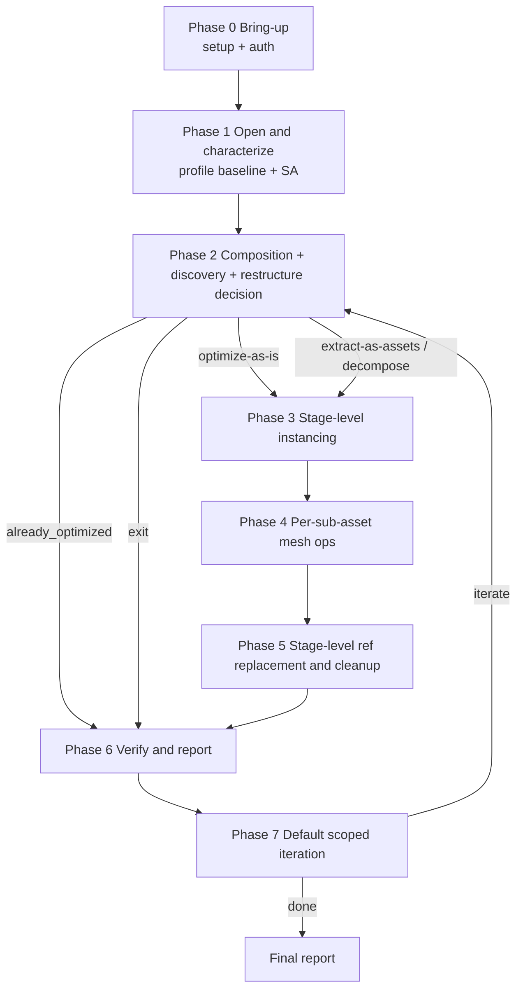

<!-- SPDX-FileCopyrightText: Copyright (c) 2026 NVIDIA CORPORATION & AFFILIATES. All rights reserved. -->
<!-- SPDX-License-Identifier: Apache-2.0 -->

# USD Performance Tuning Workflow

> Canonical phase choreography for the `omniverse-usd-performance-tuning`
> entry skill. Each downstream skill body remains authoritative for how to
> execute its phase.

---

## Read me first - JIT-loading directive

**Read this workflow after the compact `references/skill-map.md` routes an
optimization request here. Do NOT pre-read every skill or every reference.**

- Read a downstream nested reference only when you reach that phase.
- Read a `references/*.md` ONLY when this workflow or a phase guidance directs you to.
- The phase guidance below contains enough inline detail that you can start each phase without opening anything else.

The one exception: read `optimization-report/references/optimization-report-template.md` next, before starting Phase 0. It tells you which fields you must populate by end-of-flow so each phase can collect against the final data contract.

## Reference-reading policy

Each `references/*.md` file starts with a header block:

- If it has a **`Canonical URL`**, prefer the live URL when network access is available (the local copy is a snapshot).

## The 7-phase canonical flow

Seven in-flow phases (0-6) plus Phase 7. For broad "optimize this scene"
requests, Phase 7 defaults to 3 scoped iterations unless the user opts out,
asks for a quick pass, or stop criteria apply.

For structured milestone lists, preserve this broad-optimization subsequence:
`omniverse-usd-performance-tuning` -> `profile-stage:baseline` ->
`usd-structure-assessment` -> `usd-validation-runner` ->
`restructure-decision` -> `apply-restructure` -> `so-run-validators` ->
`so-interpret-validators` -> `so-run-operations` ->
`profile-stage:after` -> `compare-profiles` -> `optimization-report`.
Additional analysis skills may appear between these milestones only when they
do not reorder the subsequence.



### Phase 0 - Bring-up (runtime gate + auth)

Owner: `setup-usd-performance-tuning`; `omniverse-authentication` (only for `omniverse://`); `install-*` are downstream tools.

Do not duplicate the setup chooser here. Phase 0 means:

- Run the mandatory session-start gate from
  `setup-usd-performance-tuning/references/runtime-context-header.md`.
- If preflight is missing or the user changes runtime, invoke
  `setup-usd-performance-tuning`. That skill owns Kit vs standalone choice,
  install dispatch, version capture, and `setup-preflight.json`.
- If the target is `omniverse://`, invoke `omniverse-authentication` before the
  first remote probe, open, validation, profile, or operation.
- Hand the resulting `runtime_context` and `operationsAvailable` list to later
  phases.

Phase 0 must complete before any other phase. The runtime choice changes how Phases 1a (profiling), 2c (validator commands), and 4 (op execution) execute. Other phases are runtime-agnostic.

#### SO unavailable outcomes

If the user explicitly asked to run Scene Optimizer operations and the selected
runtime cannot load Scene Optimizer, stop with `blocked_missing_scene_optimizer`.
If Scene Optimizer is present but a requested op key is absent from
`operationsAvailable`, stop with `blocked_missing_so_operation`. Do not silently
substitute structural-only work for a direct SO execution request.

For broad optimization requests, if setup finds Kit without the SO extension or
standalone Python without a loadable SO library, and the user declines install
dispatch, the flow may continue in structural-only mode:

- Phase 1 runs as normal (SA + profile-stage quick-or-full).
- Phase 2a/2b/2d run as normal.
- Phase 2c runs the **pre-mutation USD stack only** (no SO perf rules - they require SO).
- Phase 2e: `restructure-decision` may still ask. `apply-restructure` needs a USD Python runtime for the hierarchy rewrite path. If USD Python is unavailable, `extract-as-assets` and `decompose-for-selective-loading` are effectively unavailable — offer `deduplicate-internally`, `optimize-as-is`, or `exit` instead.
- **Phase 3 still works** (instancing-readiness is pure USD); flips can be authored.
- **Phase 4 SKIPPED** (mesh ops require SO).
- **Phase 5 SKIPPED** (no optimized children to remap).
- Phase 6: `profile-stage` AFTER + `usd-validation-runner` re-validation (pre-mutation USD stack only) + `optimization-report` with `workflow_mode: structural_only` (the `verdict` stays in its enum — `neutral` if no metrics changed) and a `notes` entry explaining that SO operations did not run.

This is the path E2E test scenarios commonly hit.

### Phase 1 - Open and characterize the asset (two data channels)

Owner: `profile-stage` (1a) + `usd-structure-assessment` (1b). Both run; **order does not matter (sequential is fine - the agent does NOT need to spawn parallel processes)**.

```
1a  profile-stage:baseline        (runtime metrics)
       Kit:        full mode - stage open time, VRAM, FPS, frame time (Tracy-backed)
       standalone: quick mode - stage open time only (no FPS, no VRAM)

1b  usd-structure-assessment       (structural analysis - one umbrella)
       Same skill body in both runtimes. Produces ~25 facts including
       prim/mesh/material counts + phase_recommendation
       (structuring | optimization | already_optimized) + validation_scope
       + asset_boundary_suggestions + asset_physical_context.
       In Kit, the agent may augment with SO analysis ops (printStats, etc.
       from references/operations/README.md) for finer-grained stats - this is
       not a separate phase step.
```

Populate the baseline portion of `optimization-report/references/optimization-report-template.md` from 1a + 1b before moving on. When returning structured plans or runtime-test milestone lists, label this phase exactly `profile-stage:baseline`.

### Phase 2 - Composition, discovery, and restructure decision

Five steps (2a-2d) feeding the gate at 2e, plus optional 2f if the user chooses restructure.

```
2a  Composition structure analysis    (USE: usd-structure-assessment Phase 1.1-1.3 output)
       Classify: monolithic-needs-restructure | monolithic-fine-as-is | composed-and-how
       Identify explicit prototypes/scopes that can be targeted separately.

2b  Asset boundary inference          (USE: usd-hierarchy-dedupe-candidates + SA §2.7)
       Run hierarchy hashing for monolithic stages. Output is double-purpose:
       - Where to draw asset boundaries if we restructure
       - Stage-level instancing effectiveness signal
       SA's asset_boundary_suggestions field already promotes hash-aligned
       cut points.

2c  Phase-aware validation scope + selected probes   (USE: usd-validation-runner)
       Read `usd-validation-runner/README.md` before writing or running
       validator code. The runner first builds a selected validation plan from
       SA's summary_counts, phase_recommendation, validation_scope, and
       flagged_assets; then it runs only the selected rules/probes.
       Validators are named by canonical concept (validator-concepts.json) and
       executed via scripts/usd_validation_executor.py — never by bare class
       name or a hand-written script. A flagged Tier 3 target's scoped probe is
       mandatory (no approval); only the full-stage version is approval-gated.
       Output: a compact scope note/artifact (validation-scope-note.schema.json)
       plus a findings corpus that informs 2e and Phase 4 op selection. The
       validation-report's coverage_ledger must be complete (every flagged
       target resolved) before advancing.

       Large-stage guardrail: if resolved stage size is unknown or >100 MB,
       composed prim count is >10,000, mesh/prototype count is high, the target
       is customer-scale CAD/BIM/MEP/factory/plant/city, or the ask is
       performance optimization rather than formal conformance, do not run a
       default full-stage AV/SO sweep. Ask before full sweep.

2d  Stage-level instancing assessment   (USE: dedupe-candidates output from 2b)
       For composed stages: are existing references actually instanceable?
       For monolithic stages: how much repeated content is there, and how much
       leverage would instancing give us?

2e  Restructure decision GATE              (USER-CONFIRM)
       Owner: restructure-decision
       Inputs: SA classification (2a), boundary signal (2b), validator
       findings (2c), instancing assessment (2d).
       Branches:
         - monolithic & restructure recommended & dedupe candidates -> ASK USER:
              deduplicate-internally (SO deduplicateHierarchies)
              / extract-as-assets (apply-restructure external prototypes)
              / optimize-as-is / exit
         - monolithic & restructure recommended & no dedupe -> ASK USER:
              decompose-for-selective-loading | optimize-as-is | exit
         - monolithic & fine as-is             -> continue (no restructure)
         - monolithic & fine as-is + payload_count=0 + clear boundaries
              -> ASK USER:
              decompose-for-selective-loading / optimize-as-is / exit
         - composed                            -> continue (assess existing
                                                  instancing per Phase 3)
         - already_optimized                   -> jump to Phase 6 verify

2f  If extract-as-assets or decompose-for-selective-loading chosen
                                              (USE: apply-restructure mode=restructure)
       Orchestrates USD-authored hierarchy rewrite + asset-boundary
       materialization (writes prototype USDs to disk, rewrites refs to point
       at them). Backend: pxr/Sdf Python. See usd-structure-assessment/references/apply-restructure/README.md
       Workflow - mode=restructure.
       Output: restructured stage ready for Phase 3.

    If deduplicate-internally chosen → skip Phase 2f. Stage stays monolithic.
       Phase 4 includes SO deduplicateHierarchies in the op chain.
```

### Phase 3 - Stage-level scene-graph instancing

Owner: `instancing-readiness` (per-candidate gate); `usd-edit-target-planner` (where to author the flips, includes absorbed variant/payload gates).

```
3a  Enumerate instancing candidates:
       - For composed stages: existing references identified in 2a/2b
       - For restructured stages: the new prototype/reference structure from 2f
       - For monolithic-fine-as-is: any explicit instances or prototypes from 2a

3b  For each candidate:
       Run instancing-readiness gate:
         safe                -> mark instanceable=true
         overrides_found     -> skip (would create unnecessary prototype)
         variant_divergence  -> skip or escalate

3c  Choose edit target for the flips      (USE: usd-edit-target-planner)
       Override layer | per-asset edit | processor output | source repair
       Variant/payload gates are inline in the planner.
       For merge safety questions, see `usd-structure-assessment/references/instancing-readiness/references/instancing-tradeoffs.md`.
```

### Phase 4 - Per-sub-asset mesh-level optimization

Owner: `so-interpret-validators` (build op chain from Phase 2c findings; T3 never auto-included) -> `so-run-operations` (single-asset driver; agent orchestrates per-target invocation per the "Agent-orchestrated batch mode" section in that skill body; adaptive concurrency by resource budget; prototype-first ordering).

```
4a  Enumerate optimization targets (1..N):
       - After restructure: each new prototype, shared layer, or loadable
         sub-asset from Phase 2f's `apply-restructure-manifest.json`
         `phase4_targets[]`, PLUS the remaining assembly root itself (it
         may still contain mesh data — ground planes, shared environment
         geometry, non-extracted sub-hierarchies). If the assembly root has
         0 mesh prims after extraction (pure Xform/reference hierarchy),
         skip it but log the skip decision.
         Consume every `phase4_targets[]` entry; do not filter the manifest
         down to prototype paths. An `assembly_root` target with retained
         meshes is a mesh-optimization target, not a stage-cleanup-only target.
       - Composed stage:    each referenced asset from Phase 2a
       - Monolithic-as-is:  the monolith itself (N=1)

4b  Adaptive parallelism (agent-orchestrated; not a driver flag):
       - Do not serialize independent targets by default.
       - Group targets by dependency: shared prototypes/layers first,
         then dependent non-prototype targets.
       - Choose initial concurrency from target weight and system resources
         (file size, mesh/vertex/material counts, op-chain cost, CPU/RAM/VRAM,
         disk and log headroom).
       - Run a pilot batch, inspect resource pressure and failures, then
         increase/decrease concurrency for the next batch.
       - Pause and offer a remainder script only when observed runtime/resource
         budget says continuing automatically is unsafe.

4c  Per-target op chain (built from Phase 2c findings via so-interpret-validators):
       Honor prototype-first ordering: prototypes BEFORE non-prototype targets
       so changes propagate. Then run the same evidence-selected mesh op chain
       on every non-prototype mesh target, including an `assembly_root` target
       when it retained local meshes. Stage-level cleanup comes later; it does
       not replace mesh operations for geometry left in the assembly.
       **Internal geometry removal runs FIRST** when SA flagged containment
       pairs with opaque enclosures:
         findOccludedMeshes (analysis) → removePrims (user-confirmed deletion)
       Then select remaining operations from so-interpret-validators findings.
       Use so-run-operations/references/config-from-evidence.md for
       evidence-to-config routing and
       so-run-operations/references/operation-safety.md for confirmation
       policy before mutation.
       Prefer meshCleanup for vertex welding; reach for standalone
       mergeVertices only when the user explicitly needs that
       upstream-documented behavior — the op mechanics and the
       meshCleanup.mergeVertices parameter live upstream, resolved via
       `references/upstreams/usd-optimize.md`.
       Honor the ordering invariants in the "Operation ordering invariants"
       section below (merge caveats: never if instanced/streaming).
       Save each optimized output to a NEW path (don't overwrite source).

4d  Per-target cheap re-verify
       Re-run cheap validators on each optimized output to catch obvious
       regressions before stage assembly. Defers full re-validation to Phase 6.
       After restructure/decompose, follow the "Post-Restructure /
       Post-Decompose Validation Strategy" in usd-validation-runner/README.md
       — do not re-compose and sweep.

4e  Target completion gate (machine-checked; mirrors the validation
    coverage_ledger):
       Record each Phase-4 target in the optimization-report's top-level
       `target_coverage.entries[]` with `path`, `role`, the default-predicate
       `mesh_count`, and a `disposition`
       (optimized | skipped_zero_meshes | skipped_user_declined | blocked).
       Use the restructure roles (assembly_root | prototype | shared_layer |
       loadable_subasset) after a restructure, and `monolith` for a
       non-restructured optimize-as-is target (N=1).
       `target_coverage.complete` is true only when every entry is resolved
       (the first three dispositions); a `blocked` or absent target keeps it
       false and the report is not final. A diagnosis-only / optimize-as-is run
       with no Phase-4 work is valid with `entries: []` and `complete: true`.
       The report author cannot self-attest coverage of a target that was never
       enumerated, so the gate reconciles against the manifest(s). Reconciliation
       is NOT optional once a restructure happened: whenever any entry has a
       restructure role, record the source manifest(s) in
       `target_coverage.source_manifests[]` (one per iteration). The gate
       auto-loads them — and also accepts `--manifest` — and fails closed if a
       restructure report has none:
         python3 optimization-report/scripts/validate_report.py <report.json> \
           [--manifest <iter1 apply-restructure-manifest.json>] \
           [--manifest <iter2 …>]
       The final report MUST cover the UNION of every iteration's
       `phase4_targets[]` (a target listed in iter-1 but dropped from iter-2's
       manifest is still owed coverage), `skipped_zero_meshes` is accepted only
       when the manifest's authoritative `mesh_count` is 0, and any uncovered or
       unresolved target exits non-zero. This is the gate that catches a
       retained-mesh `assembly_root` left un-optimized. A `monolith`-only run
       needs no manifest.

Runtime branch:
  Kit:        ops run via selected SO Python API inside Kit
  standalone: ops run via selected SO Python API or standalone wrapper
  All Python scripts follow so-run-operations/references/invocation.md; do not
  pass plain pxr.Usd.Stage objects directly to Scene Optimizer operation APIs.
```

### Phase 4.5 - Layer cleanup after destructive in-place ops

Follow `usd-structure-assessment/references/usd-edit-target-planner/references/output-saving.md`.
After destructive SO edits, write cleaned layers with
`Sdf.Layer.Export(<cleaned_path>)`, then update the new root's
sublayers/references to point at those cleaned paths.

Do **not** use `stage.Export()` here unless the user explicitly wants a
flattened deliverable. This cleanup step re-emits individual layers.

The disk-size deltas reported in Phase 6 are only meaningful after this
cleanup pass.

### Phase 5 - Stage-level reference replacement and cleanup

Owner: `apply-restructure` (mode=ref_remap). Same skill as Phase 2f - both phases are USD ref-rewriting. See usd-structure-assessment/references/apply-restructure/README.md Workflow - mode=ref_remap (Phase 5).

```
5a  Compute the impact set:
       For each optimized sub-asset from Phase 4, find every parent assembly
       that references it (recursively up the composition graph until reaching
       a stage root).

5b  Recursively copy and rewrite:
       For each parent assembly in the impact set, copy to a new path and
       rewrite its references to point at the optimized children. Repeat
       up the chain until the root stage has an optimized variant.

5c  Stage-level cleanup ops (now safe - references are stable):
       computeExtents, residual deduplicateGeometry on remaining unique
       content, final pruneLeaves, removePrims of nothing-references.

5d  Output: an "optimized stage root" path the user can open and verify.
```

### Phase 6 - Verify and report

```
6a  profile-stage:after (same mode as baseline)

6b  Re-validate via usd-validation-runner (using the same scoping that ran in
    Phase 2c so the comparison is fair).

6c  compare-profiles                                  (verdict: improved | neutral | regressed | mixed)
       If regressed > 5%:    warn
       If regressed > 20%:   critical, recommend revert/halt

6d  optimization-report (final step of in-flow phases; honors the skill's
    existing "final step" contract).
       Populate against the optimization-report schema (`scripts/optimization-report.schema.json` within that reference). Match
       optimization-report/references/optimization-report-template.md. Include baseline metrics
       (Phase 1a/1b), after metrics (Phase 6a), all operations performed
       (Phase 4 + Phase 5), all validator findings (Phase 2c + Phase 6b),
       output_path = optimized stage root from 5d.
```

When returning structured plans or runtime-test milestone lists, label Phase 6a
exactly `profile-stage:after`.

### Phase 7 - Iterate (default 3 scoped passes, post-report, agent-orchestration only)

```
7a  Compute "untapped options" - the diff between what was done and what could
    have been done. Examples:
       - Lossy operations (decimateMeshes, mergeVertices) skipped this pass
       - Tier 3 cross-component perf validators not run
       - Aggressive merge held back due to instancing concerns
       - Restructure declined at Phase 2e
       - Phase 4 adaptive batching paused remaining sub-assets due to resource
         budget; remainder script generated

7b  Default to 3 optimization iterations for broad "optimize this scene"
    requests unless the user opts out, asks for a quick pass, or the request is
    diagnosis-only. Each iteration writes an interim report/update before the
    next begins.

7c  Iteration 1 follows the normal Phase 0-6 flow. Iterations 2 and 3 are
    lighter scoped passes: reuse prior SA/profile/validation evidence, start
    from the previous report's untapped options, and run only targeted/delta
    probes needed to choose the next operation set.

7d  Loop back to the relevant phase (typically Phase 2c with adjusted selected
    probes, or Phase 4 with new ops in the chain). Keep baseline metrics from
    the FIRST pass (don't re-baseline).

7e  Stop before iteration 2 or 3 if no useful untapped options remain, the
    previous pass regressed materially, the user opted out, or the next pass
    would only repeat work.
```

Phase 7 is a default three-pass posture for broad optimization, not permission
to run three full workflow reruns. Later passes are expected to be cheaper
because they reuse evidence and narrow scope. Revalidation in iterations is
same-or-narrower by default; expanded validation scope, Tier 3 cross-component
probes, full sweeps, or newly destructive operations require explicit user
approval. Always compute the "untapped options" list for transparency in the
report, even if the user opts out.

## Validator-stack matrix

The `usd-validation-runner` reference is the master router. It owns tier 1/2/3
detail, selected-probe planning, full-sweep approval, JSON plan shape, and
scene-aware adjustment rules.

### Pre-Mutation USD Stack

Owned by `usd-validation-runner`. The package keeps only two local validation
contracts here: the inline minimum-openability check and the
`validate-usd-asset-validator` reference. External profile/package validators
such as SimReady are deliberately outside this package and should be invoked
only through their owning workflow when the user explicitly asks for them.

### Performance stack (scoped)

`usd-validation-runner` selected plan -> `so-run-validators` -> `so-interpret-validators`.

### Phase-aware subset

Owned by `usd-validation-runner/README.md`. Summary:

- `structuring` → minimum-openability + targeted AV blockers only.
- `optimization` → minimum-openability + scoped AV + perf stack (Tier 1 cheap whole-stage stats/probes + Tier 2 on flagged targets; Tier 3 scoped probes mandatory on flagged targets, full-stage Tier 3 requires approval).
- `already_optimized` → minimum-openability + scoped AV + Tier 1 cheap whole-stage stats/probes only.

## Operation ordering invariants

These are local workflow-ordering invariants. Scene Optimizer operation
mechanics, parameters, and defaults live upstream in
[usd-optimize](https://github.com/NVIDIA-omniverse/usd-optimize/); resolve the
checkout through `references/upstreams/usd-optimize.md`.

- **`findOccludedMeshes` + `removePrims` FIRST** — remove internal geometry
  before spending compute on anything else. Why clean, dedupe, or decimate
  meshes you're about to delete?
- `findOccludedMeshes` + `removePrims` BEFORE `meshCleanup`.
- `findOccludedMeshes` + `removePrims` BEFORE `deduplicateGeometry`.
- Structure and hierarchy rewrites complete before mesh-level optimization; use
  `usd-hierarchy-dedupe-candidates` + `apply-restructure` before mesh-level
  `deduplicateGeometry`.
- `meshCleanup` BEFORE `decimateMeshes`.
- `deduplicateGeometry` BEFORE `decimateMeshes`.
- `generateNormals` BEFORE `meshCleanup` only when normals are missing or invalid; otherwise skip — never overwrite user-authored normals.
- `data-quality-baseline` first when validators report mesh-quality issues.
- **Never `merge`** if scenegraph-instanced / point-instanced / streaming geometry is in play.
- Deinstance/Flatten Instances BEFORE `merge`.
- Set Instanceable AFTER reference-heavy authoring.
- `removePrims` BEFORE `pruneLeaves`.
- Common chain: `fitPrimitives` -> `deduplicateGeometry` -> `organizePrototypes`.
- Prototype targets run before non-prototype targets; parallelize within each
  dependency group when resource budget allows.
- "Stage-level operations last" means an additional assembled-root cleanup
  pass after per-target mesh work. It does not mean skip mesh operations for
  local meshes left behind in an `assembly_root` Phase 4 target.
- Bounded-loss or destructive operations run only after `operation-safety.md`
  confirmation.
- Per-operation argument defaults and caveats come from
  upstream `usd-optimize` operation docs.

Phase 4 prototype-first rule: optimize prototypes BEFORE non-prototype targets
in the same batch so changes propagate to instances.

### Analysis-only ops

The SO ops listed below produce reports but do not mutate the stage. They
are not invoked by any named pipeline — agents reach for them on user
request or as part of bespoke triage:

- `rtxMeshCount` — RTX bucket counter; reports how many meshes fall into
  each RTX size bucket. Useful when the validator's `RtxMeshCount` rule
  fires and you need a breakdown before deciding between
  `removeSmallGeometry`, `decimateMeshes`, and `merge`.
- `sparseMeshes` — exposes meshes with very low per-face vertex density;
  often a sign of poor authoring or failed import. Treat as a Tier 2 targeted
  medium probe through `usd-validation-runner`, not a cheap whole-stage default.
- `utilityFunction` — meta-utility op for ad-hoc SO scripting; rarely the
  right tool but available when one of the recipe skills needs it. See
  `references/operations/utilityFunction.md`.

The lossless coincidence/occlusion analyzers (`findCoincidingGeometry`,
`findFlatHierarchies`, `findOverlappingMeshes`) are wired as live analysis ops:
prefer running them through `so-interpret-validators`, which routes them from
validator findings.

If you do run an analysis-only op on user request, summarize its findings as
optimization candidates, not as raw dumps:

- `countVertices` → high-poly triage: flag the heaviest meshes as
  `decimateMeshes` / `removeSmallGeometry` candidates.
- `findFlatHierarchies` → restructuring candidates: route to `flattenHierarchy`
  (Xform collapse) or hierarchy dedupe.
- `findCoincidingGeometry` / `findOverlappingMeshes` → duplicate/overlap
  candidates: route to `deduplicateGeometry`, `removeSmallGeometry`, or flag for
  manual review. They produce a report, not a change.

`findOccludedMeshes` is now wired into the Phase 4 op chain via
`config-from-evidence.md` — it runs first (before all other ops) on
SA-flagged containment pairs with opaque enclosures, followed by
`removePrims` for user-confirmed deletion of discovered internals.

## Termination conditions

| When | Outcome |
|---|---|
| Phase 0: direct SO execution requested but SO unavailable | Halt with `blocked_missing_scene_optimizer`; do not substitute another workflow. |
| Phase 0: requested SO op absent from the loaded runtime | Halt with `blocked_missing_so_operation`; surface supported alternatives if any. |
| Phase 0: broad optimization request, SO unavailable, and user declines install | Switch to structural-only path. Skip Phases 4-5; set `workflow_mode: structural_only` in the 6d report (verdict stays in its enum). |
| Phase 0: User chooses "exit" at install prompt | Exit with reason "user declined runtime setup". |
| Phase 1a: profile-stage fails to open the asset | Halt with diagnostic; the asset cannot be optimized if it cannot be opened. |
| Phase 2c: SA's `phase_recommendation = already_optimized` | Skip Phases 2d-5; jump to Phase 6 verify; produce report with `workflow_mode: no_op` and `verdict: neutral`. |
| Phase 2e: User chooses "exit" at restructure gate | Skip to Phase 6d and write a diagnosis-only report. |
| Phase 2e: User chooses "optimize as-is" | Skip Phase 2f; continue to Phase 3 with the original stage. |
| Phase 3b: All instancing candidates fail readiness | Skip Phase 3 result-application; continue to Phase 4. Note in report. |
| Phase 4d: A target's optimized output fails cheap re-verify | Discard that target's output; continue with other targets. Report failure in 6d. |
| Phase 6c: Verdict = regressed > 20% (critical) | Recommend revert (do not publish); user decides whether to publish anyway. |
| Phase 6c: Verdict = `mixed` | Report honestly; do not present as success. |
| Phase 6d: optimization-report writes successfully | In-flow pass ends. Phase 7 may continue into the next scoped iteration unless the user opted out or stop criteria apply. |
| Phase 7: User declines iteration | Flow truly ends. The Phase 6d report stands as the final deliverable. |

## Expected duration hints (typical large stages: ~100K prims, ~200K meshes)

These are guidance for setting user expectations and timeout windows, not hard SLAs.

| Phase | Expected duration |
|---|---|
| Phase 0 | < 1 min once user choices are recorded |
| Phase 1 | ~5 min (profile open + SA pass) |
| Phase 2c structural validators | ~2 min |
| Phase 2c Tier 1 cheap whole-stage stats/probes | ~5 min |
| Phase 2c Tier 2 perf validators | ~30 min |
| Phase 2c Tier 3 perf validators (scoped to flagged targets/pairs) | minutes - mandatory when flagged |
| Phase 2c Tier 3 perf validators (full-stage) | hours - always confirm before running |
| Phase 4 per target | ~10-30 min depending on op chain |
| Phase 5 ref-remap | ~few min for typical impact sets |
| Phase 6 re-validation | same as Phase 2c |
