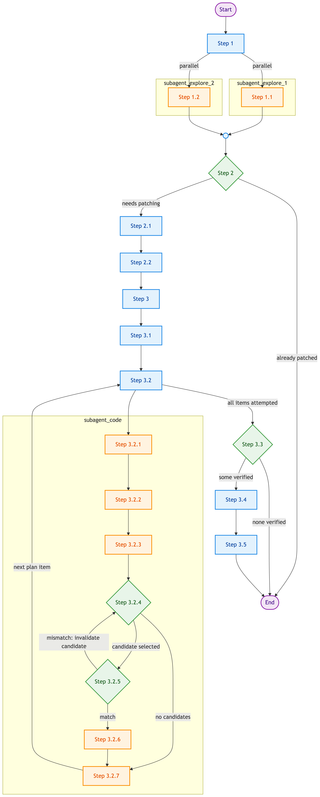
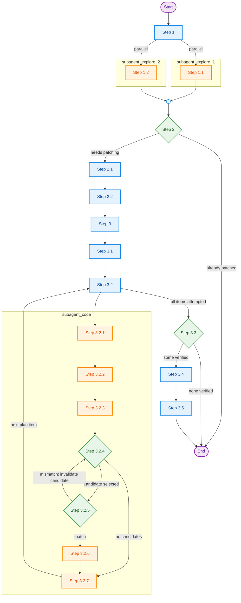

# Integrate TileGym kernels to Transformers
The integration process follows a "research kernel requirement and supply -> propose kernel integration candidates -> implement kernel integrations and verify -> aggregate valid integrations" workflow. Kernel requirements and supplies must be represented with FlashInfer-Bench-style Definition and Solution metadata. Follow the kernel inventory schema linked from `SKILL.md` for metadata and file layout rules. Refer to the diagram below to understand the overall process, then check the numbered text below for details. If you find it difficult to interpret embedding Mermaid script, check the rendered PNG image which represents the exactly identical workflow diagram:
<details>


</details>



- Mapping note: `Step 1.1/1.2` correspond to the two explore-subagent bullets under Step 1; `Step 2.1/2.2` correspond to the two plan sub-steps under Step 2; `Step 3.2.1-3.2.7` correspond to the code-subagent sub-steps under Step 3.2.

### Detailed Steps
1. Research phase: Study the target Transformer model and available kernel and monkey-patch implementation in TileGym. Launch 2 parallel explore subagents. Each subagent needs `WebSearch` + `WebFetch`; if no available agent type exposes them, the orchestrator handles web lookups itself.
   * Search the model ID on HuggingFace to know what architectures does it use. Then search GitHub code to get implementation of that architecture. To locate the integration point use any of: (a) `grep`/inspect `transformers` source **inside the Docker container** (host may lack `transformers` and deps); (b) `WebSearch`/`WebFetch` against the `transformers` GitHub repo or HF Hub model card; (c) if the model loads with `trust_remote_code=True`, the classes live not in `transformers.models.*` but in custom `modeling_*.py` downloaded to the HF modules cache (`$HF_HOME/modules/transformers_modules/<repo>/`, default `~/.cache/huggingface/...`) and resolved via `auto_map` in the model config — inspect that path inside the container after one load. Go through details to understand computations performed on every components. Summarize a comprehensive requirement list with all necessary details included and emit each reusable compute pattern as a draft FlashInfer Definition. Each Definition `reference` must start with `# Source:` comment(s) pointing to the precise upstream `transformers` GitHub permalink, or to the HF Hub model card/remote-code region for `trust_remote_code=True` models. For fused kernels, include one source comment per corresponding upstream code region. *Focus on details*. Some model might use variants of standard Attention/MoE/normalization, and/or use distinct data types at different part of computations;
   * Go through @src/tilegym/ to inventory available kernel implementations, OP interfaces, and Transformer model monkey-patches. Pay attention to the `@dispatch("<OP name>")` and `@register("<OP name>")` mappings, `apply_tilegym_kernel_to_<transformer_module>` patch patterns, and existing `kernel_solutions/*.json`. Summarize a manifest that lists all available monkey-patch functions, OP interfaces, and kernel implementations, and emit each reusable implementation as a FlashInfer Solution with repo-relative source paths. *Refer to but don't rely on docstring/comments; focus on details that distinguish similar kernels*. If unsure about `cuda.tile` kernel semantic, check https://docs.nvidia.com/cuda/cutile-python/operations.html.
2. Plan phase: Check if the target model architecture is already patched. If so, inform the user and exit; Otherwise, propose an integration plan following these sub-steps:
   1. Check the Definition requirement list and Solution manifest to determine which computations could be patched by TileGym implementations. Be optimistic since subsequent steps/subagents will drop unsuitable proposals;
   2. For each selected computation, propose candidates by matching Definitions first: exact Definition match -> reuse the Solution; compatible Definition with signature/layout gap -> propose a small adapter; no compatible Solution -> propose creating a new dedicated kernel. You may propose multiple candidates if uncertain, but keep the candidate pool small using your best judgement.
3. Execute-and-verify phase: Check develop environment, launch subagents to implement monkey-patch for each of the items in integration plan once-a-time, verify it on develop environment, and accept/reject that monkey-patch. Specific sub-steps:
   1. The orchestrator agent (i.e., you) checks the Docker container is available, GPU UUID reported inside the Docker container is expected, and current git branch does not have unstaged/uncommitted changes
   2. For each unverified integration plan item (i.e., a mapping of Transformer model compute <-> one or more TileGym implementation candidates), launch a code subagent **sequentially, one at a time** — purpose is context isolation, not parallelism; concurrent subagents race on `src/tilegym/transformers/<submodule_name>/` and on the Docker container. Subagent needs filesystem read/write + Bash (in-container test runs); web access not required. Tell this subagent how to invoke command in our Docker environment and its workflow:
      1. Study @src/tilegym/transformers/monkey_patch.py, @modeling/transformers/src/tilegym_hf_bench/tilegym_patch.py, and @modeling/transformers/src/tilegym_hf_bench/_cli.py to understand how to monkey-patch a transformer model with TileGym implementation;
      2. Locate the integration point at `transformers` library. E.g., It could be a `nn.Module` subclass that corresponds to a layer in the transformer model, or an utility function that applies certain modification to transformer models' intermediate variables/tensors;
      3. Collect inputs and outputs around integration point to serve as subsequent verifications' references. You can create a simple debug Python script that calls `transformers` library's `.generate()` API to prompt the Transformer model to output "The capital of France is", and add code before and after the integration point to save intermediate PyTorch tensors and other necessary variables to disk as future references. *Critical: unoptimized `.generate()` is slow, collect as less data as possible*;
      4. Select the next unverified TileGym implementation candidate. If no unverified candidate is available, exit current subagent and let the orchestrator agent know that the current Transformer compute is unsuitable for TileGym to patch. Otherwise, implement a monkey-patch function following the convention studied at sub-step 3.2.1. If the candidate is a reusable new kernel, place the kernel implementation in src/tilegym/transformers/<submodule_name>/kernels/<kernel_name>.py and create matching `kernel_definitions/<kernel_name>.json` and `kernel_solutions/<kernel_name>.json`. Before keeping the Definition, revisit its `reference` snippet and verify every `# Source:` permalink points to a precise corresponding code region in upstream `transformers` or remote model code. The patch function of current compute goes to src/tilegym/transformers/<submodule_name>/monkey_patch_<compute_name>.py. If additional modifications are need for the current transformer model (similar to the scenario of @src/tilegym/transformers/deepseek2/modeling_deepseek.py), check existence (create by other subagents) or create a self-contained Python submodule src/tilegym/transformers/<submodule_name>/modeling_<submodule_name>.py and place model-specific patching glue there;
      5. Verify the monkey-patch implementation at sub-step 3.2.4 by creating a Python script that instantiate a submodule that contains integration point, apply the monkey-patch, feed input data collected at sub-step 3.2.3, and collect output data. The output data should match the reference output collected at sub-step 3.2.3 within a reasonable error tolerance. Try your best to fix errors caused by integration and to resolve mismatch. If can't fix, mark current TileGym implementation candidate as invalid and go back to sub-step 3.2.4; Otherwise continue to next sub-step;
      6. Consolidate the debug and test code you implemented to src/tilegym/transformers/<submodule_name>/test_monkey_patch_<compute_name>.py and organize it in pytest style and remove all other files/scripts/documents/binary data files you created during debugging. Ensure only left one test case that checks input-output around the integrating point match with those from origin implementation and ensure the test case pass. At this point, src/tilegym/transformers/<submodule_name>/ directory should look like:

         ```text
         src/tilegym/transformers/<submodule_name>/
         |- __init__.py # Create if not exist; License headers only
         |- kernel_definitions/  # FlashInfer Definitions for reusable kernels.
         |- kernel_solutions/  # FlashInfer Solutions referencing kernels/*.py source paths.
         |- kernels/  # Reusable kernel implementations and thin wrappers.
         |- monkey_patch_<compute_name>.py  # Patch function for compute assigned to current subagent.
         |- test_monkey_patch_<compute_name>.py  # Test logic specific to <compute_name> patching.
         |- # Optional [monkey_patch_<other_compute_name>.py, test_monkey_patch_<other_compute_name>.py] pairs created by other subagents assigned with <other_compute_name>s.
         |- modeling_<submodule_name>.py  # Optional if need to modify submodule or function, could be initially created by other subagents.
         ```
      7. Exit the current subagent and let orchestrator agent know that the assigned Transformer compute can be patched by TileGym implementation verified at sub-step 3.2.5 and 3.2.6 and the patch function is available at src/tilegym/transformers/<submodule_name>/monkey_patch_<compute_name>.py.
   3. Aggregate all verified computes and corresponding patches. If none of the compute can be faithfully integrated, exit the workflow and let users know; Otherwise, aggregate all patching logic to a main monkey-patch function `def apply_tilegym_kernel_to_<submodule_name>(...)` and place it at @src/tilegym/transformers/monkey_patch.py. Each compute has a corresponding boolean flag as function argument;
   4. Update @modeling/transformers/src/tilegym_hf_bench/tilegym_patch.py to include the main monkey-patch function in the inference and benchmark flow. If a new model preset is needed, add it to @modeling/transformers/scripts/benchmark_hf_model.sh. Ensure the cuTile benchmark path passes `--use_cutile`, as we focus on cuTile backend;
   5. Run the end-to-end inference script created at sub-step 3.4. It should print ~300 lines of plain text. Collect baseline throughput, cuTile kernelized throughput, and cuTile kernel coverage by `grep -E "Average throughput|cuTile Kernel Coverage \(GPU Time\)" <output_file>`. Example output:
      ```text
      Average throughput: 25.93 ± 3.20 tokens/sec
      Average throughput: 53.41 ± 0.25 tokens/sec
      >>> cuTile Kernel Coverage (GPU Time):    49.21% <<<
      ```
      Git commit current changes **except those standalone monkey patch files and tests** created at step 3.2.6. I.e.:
      ```text
      src/tilegym/transformers/
      |- monkey_patch.py  # check modifications to git
      |- <submodule_name>/
         |- __init__.py  # check to git
         |- kernel_definitions/  # check verified reusable Definition metadata to git
         |- kernel_solutions/  # check verified reusable Solution metadata to git
         |- kernels/  # check verified reusable kernel files to git
         |- monkey_patch_<compute_name>.py  # don't check to git
         |- test_monkey_patch_<compute_name>.py  # don't check to git
         |- # Optional [monkey_patch_<other_compute_name>.py, test_monkey_patch_<other_compute_name>.py] pairs created by other subagents assigned with <other_compute_name>s --- don't check to git
         |- modeling_<submodule_name>.py  # check to git
modeling/transformers/
|- scripts/benchmark_hf_model.sh  # update model presets if needed
|- src/tilegym_hf_bench/
   |- tilegym_patch.py  # check model dispatch modifications to git
   |- kernel_filters/tilegym_kernel_prefixes.yaml  # check kernel filter updates to git
      ```
