# RTVI-CV Runbook

Deploy, operate, debug, and tear down the **Real Time Video Intelligence CV
(RTVI-CV)** microservice. The agent collects credentials once, detects the
platform, downloads NGC resources, configures the pipeline, launches the
container, applies all required config edits, and starts the app.

> **Service**: `rtvi-cv` (`metropolis_perception_app`)
> **Image**: `nvcr.io/<org>/<repo>:<tag>` — user-supplied at deploy time
> **REST port**: `9000` (stream add/remove, health, metrics)
> **Hardware**: x86/aarch64 dGPU (T4, A100, L40, H100, B200, RTX), SBSA
> (Spark, Grace-Hopper), Jetson (Thor, Orin, Xavier)

---

## Use Cases

| Use case            | Model                              | Inference engine          | Notes                                              |
|---------------------|------------------------------------|---------------------------|----------------------------------------------------|
| `warehouse-2d`      | RT-DETR + NvDCF tracker            | `nvinfer` (PGIE)          | 7 classes, DS auto-builds engine, skill caches it. |
| `warehouse-3d`      | Sparse4D (multi-camera BEV)        | `videotemplate` plugin    | 6 classes, requires `LD_PRELOAD` + setup script.   |
| `smartcity-rtdetr`  | TrafficCamNet RT-DETR              | `nvinfer`                 | 5 classes, ITS use case.                           |
| `smartcity-gdino`   | Grounding DINO (open-vocab)        | `nvinferserver` (Triton)  | Prompt-based detection; engine cached as `.plan`.  |

---

## Prerequisites

- Docker Engine ≥ 20.10 with `docker` CLI (`docker --version` to verify).
- NVIDIA Container Toolkit installed (`nvidia-smi` works inside containers).
- ≥ 30 GB free disk for images + models + videos (warehouse-3d / GDINO may
  need 50+ GB).
- Free port `9000` (REST API); `9092` only if Kafka sink is enabled.
- Outbound network to `nvcr.io`, `ngc.nvidia.com`, `api.ngc.nvidia.com`.
- NGC account + API key from <https://ngc.nvidia.com/setup/api-key> (only
  needed if downloading NGC models/videos; not for local-only assets).
- For `eglsink` display output: X11 server with `$DISPLAY` set on the host.

For full secret, mount, env-var, and GPU-selection detail see
`environment.md`.

---

## Quick Start

```text
deploy rtvicv warehouse 2d with 4 streams and display the output
use this docker image <RTVI_CV_IMAGE>
use this ngc resource <WAREHOUSE_APP_DATA_NGC>
use this model <WAREHOUSE_RTDETR_ONNX> with these videos <WAREHOUSE_VIDEOSET_NAME>
```

Anything you omit, the skill asks for via `AskQuestion` or auto-detects from
the host (platform, existing containers, cached resources). At minimum you
can say `deploy rtvi-cv warehouse 2d` and answer prompts one by one.

### Placeholders

| Placeholder                   | Description                                                                                             |
|-------------------------------|---------------------------------------------------------------------------------------------------------|
| `<RTVI_CV_IMAGE>`             | Full RTVI-CV docker image, e.g. `nvcr.io/<org>/<repo>:<tag>` (use the `-sbsa-` tag variant for SBSA).  |
| `<WAREHOUSE_APP_DATA_NGC>`    | Warehouse NGC resource (`<org>/<team>/<resource>:<version>`) — used by warehouse-2d and warehouse-3d.    |
| `<SMARTCITY_APP_DATA_NGC>`    | Smart-city videos NGC resource — shared by smartcity-rtdetr and smartcity-gdino.                        |
| `<RTDETR_MODEL_NGC>`          | TrafficCamNet RT-DETR NGC model reference.                                                              |
| `<GDINO_MODEL_NGC>`           | Grounding DINO NGC model reference.                                                                     |
| `<WAREHOUSE_RTDETR_ONNX>`     | Warehouse 2D RT-DETR ONNX filename (resolved inside the NGC app-data resource).                         |
| `<WAREHOUSE_VIDEOSET_NAME>`   | Named video set inside the warehouse NGC resource (e.g. a 4-camera test set).                           |
| `<LOCAL_*_ONNX>` / `<LOCAL_VIDEOS_DIR>` | Host paths to override the NGC defaults with local files / directories.                       |
| `<N>`                         | Batch size / max stream count.                                                                          |

### What you can specify inline

Anything *not* pinned by the user query is asked via the Step 2 `AskQuestion`
(no silent defaults — see the "What gets asked" section below).

| Param            | Phrases that pin a value (skip the question)                                                            |
|------------------|---------------------------------------------------------------------------------------------------------|
| Use case         | `warehouse 2d`, `warehouse-3d`, `smartcity rtdetr`, `smartcity gdino`, `sparse4d`                       |
| Batch / streams  | `with 4 streams`, `batch 8`, `4 cameras`                                                                |
| Stream mode      | `dynamic` / `via rest` / `add via api` / `live add` → dynamic. Otherwise unpinned → ASK (default `static`). |
| Input source     | `from rtsp <url>` → RTSP. Otherwise unpinned → ASK.                                                     |
| Output sink      | `save the output in a file` → filedump; `display`/`on screen` → eglsink; `benchmark` → fakesink. Otherwise ASK. |
| Docker image     | `use this docker image <ref>`                                                                           |
| NGC resource     | `use this ngc resource <ref>`                                                                           |
| Model override   | `use this model <filename-or-path>`, `use this gdino <path>`, `use this rtdetr model <path>`            |
| Video override   | `with these videos <ngc-videoset-name-or-local-dir>`                                                    |

---

## Mode Selection — DEPLOY vs TEARDOWN

| Mode         | Trigger phrases                                                       | Goes to                                                                                       |
|--------------|-----------------------------------------------------------------------|-----------------------------------------------------------------------------------------------|
| **DEPLOY**   | `deploy`, `run`, `launch`, `start`, `set up`, `bring up`              | Step 0 → Steps 1–6 below.                                                                     |
| **TEARDOWN** | `stop`, `tear down`, `shutdown`, `kill`, `cleanup`, `remove container` | `teardown-flow.md`.                                            |

If the user's intent is clearly deploy or teardown, do not ask — proceed
directly to the matching flow. Only ask via `AskQuestion` when ambiguous.

---

## Deployment Workflow (high-level map)

The skill renders progress as a 10-task list (see `task-list.md`)
and walks through six logical steps. Each step links to the file with the
detailed bash and decision logic.

| Step | What it does                                              | Reference                                                               |
|------|-----------------------------------------------------------|-------------------------------------------------------------------------|
| 0    | Build the full task list upfront via `TodoWrite`.         | `task-list.md`                               |
| 1    | Confirm use case, platform, image, NGC creds, resources.  | `usecases.md`, `platforms.md`, `ngc-setup.md`, `resource-plan.md` |
| 2    | Pipeline configuration: batch size, streams, sink.        | `pipeline-config.md`                   |
| 3    | Launch (or reuse / restart / parallel) the container.     | `container-reuse.md`                   |
| 4    | Apply config inside the container (path sub, batch, sink, sources, engine cache lookup). | `apply-config.md` |
| 5    | Start the perception app + capture metrics + write log.   | `start-app.md`                              |
| 6    | Next steps: stream lifecycle, metrics, REST examples.     | `next-steps.md`                             |

**Teardown** is a separate 5-step flow (discover → select → method → cleanup
scope → execute) — see `teardown-flow.md`.
NGC credentials are always preserved.

### Startup contract — first response after invocation

Before *any* tool call, the agent's first reply is a **single terse line**
acknowledging the use case + values pinned by the query, immediately
followed by the `TodoWrite` / `TaskCreate` plan call(s). No bash, no file
reads beyond the skill manifest, no narration of upcoming steps, **no
narration of internal tool loading** (see Forbidden list below).

```
✔ warehouse-2d, batch=4, sink=eglsink (from query)
[TodoWrite fires here — renders the 5-task widget,
 OR 5 successive TaskCreate calls if TaskCreate is the available tool]
```

**Forbidden in the first reply:**

- "Let me start by loading the task list, detecting the platform, and resolving YAML defaults." — narrating future work re-states what the plan tool is about to render.
- **"I need to load TodoWrite (a deferred tool…)"**, "Loading TaskCreate…", "Calling ToolSearch for the planning tool…", or any other reference to tool resolution, deferred tools, or `ToolSearch`. The agent loads tools silently — the user only ever sees the `✔` summary line followed by the widget. If `TodoWrite` / `TaskCreate` happens to be a deferred tool in the current runtime, the `ToolSearch` call to load its schema is **silent** — no chat text accompanies it.
- `bash load_defaults.sh` / `uname -m` / `nvidia-smi` / any other tool **before** the planning tool call. Platform detect and YAML defaults are part of task 1/5 and run AFTER the todo list is on screen. (Internal labels for these substeps — `1.b` / `1.c` — are model-facing only; never print them to the user.)
- Multi-paragraph preambles. One sentence + the widget.

**Required ordering at startup (no exceptions):**

```
1. one-line ✔ summary of what's pinned from the query
2. Plan tool call — either:
     • TodoWrite (merge:false) — full 5-task list, task 1/5 = in_progress
     • OR 5 successive TaskCreate calls (one per task) when TaskCreate is the
       available planning tool (see task-list.md § "Initial TaskCreate calls")
3. Pre-completion of inferred tasks — either:
     • TodoWrite (merge:true) for any task fully answered by the query
     • OR TaskUpdate (status:"completed") for each pre-completed task
4. Task 1/5 begins — first bash runs here (load_defaults.sh, platform detect)
```

If the use case isn't in the query, step 1 above becomes the *only* place
the agent asks for it, before the plan tool call. Everything else stays
the same.

### Step ordering invariants — DO NOT skip ahead

The skill MUST run steps in the order below. The most common temptation is
to peek at the engine cache (or container state) before the user has
finished picking targets — this is forbidden because the cache key depends
on the chosen model.

```dot
digraph step_order {
    rankdir=LR;
    "platform + YAML defaults" [shape=box];
    "Step 1 AskQuestion\n(image, NGC resource, model, videos)" [shape=box];
    "Step 2 AskQuestion\n(batch, stream_mode, input, sink)" [shape=box];
    "Step 3 launch / reuse" [shape=box];
    "Step 4 apply-config\n(includes engine-cache lookup)" [shape=box, color=red];
    "Step 5 start-app" [shape=box];

    "platform + YAML defaults" -> "Step 1 AskQuestion\n(image, NGC resource, model, videos)";
    "Step 1 AskQuestion\n(image, NGC resource, model, videos)" -> "Step 2 AskQuestion\n(batch, stream_mode, input, sink)";
    "Step 2 AskQuestion\n(batch, stream_mode, input, sink)" -> "Step 3 launch / reuse";
    "Step 3 launch / reuse" -> "Step 4 apply-config\n(includes engine-cache lookup)";
    "Step 4 apply-config\n(includes engine-cache lookup)" -> "Step 5 start-app";
}
```



**Hard rules:**

1. **Step 1 `AskQuestion` fires BEFORE Step 2 `AskQuestion`.** Never merge
   them. Even when Step 1 has YAML defaults for every parameter, the user
   still picks each one in Step 1's question (defaults appear as the
   "Recommended" option). Don't skip ahead to Step 2 just because Step 1
   "could" be auto-answered.
2. **No engine-cache lookup before Step 4.** The cache filename is
   `<onnx-basename>_b<N>.{engine,plan}`. Until Step 1 returns the model
   choice (NGC default or custom override) AND Step 2 returns the batch
   size, the cache key is unknown — any earlier lookup is wasted work
   that a custom ONNX or a different batch invalidates.
3. **No reuse-vs-restart decision before Step 3.** Container reuse is only
   safe once Step 1 has confirmed the image and Step 2 has confirmed the
   pipeline parameters that decide whether the existing mounts are
   compatible.
4. **No bash discovery beyond Step 1.b.** Steps 1.b (platform detect via
   `uname -m` + `nvidia-smi`) and 1.c (load YAML defaults via
   `load_defaults.sh`) are the only allowed pre-AskQuestion bash.
   Everything else — `docker image inspect`, `docker ps`, listing engine
   cache, listing resources for *cosmetic* summaries — must wait until
   the user has answered Step 1's `AskQuestion`. `docker ps` for the
   container-reuse decision belongs in Step 3, not Step 1.

If the agent finds itself thinking "let me just check X to make the next
question prettier", that's the smell — stop, ask first, look later.
If the agent finds itself thinking "the YAML defaults are good enough,
let me skip Step 1's question", that's the same smell. Ask anyway.

5. **Step 6 `AskQuestion` is the final step of every successful deploy.**
   Right after the "Perception Application — Results" box, fire the
   Step 6 menu from `next-steps.md` § "11.c". Do NOT replace it with
   a free-form "Next steps:" bullet list. The menu is the user's
   handle on the running deploy.

---

## Minimal-Interaction Contract

The skill asks the user **once** for everything it cannot figure out on its
own, then runs to completion with progress prints but no further prompts.

### One-shot intake

Before any work begins, the skill builds a single consolidated `AskQuestion`
block covering:

- Docker image ref (if not in the query).
- Resource source type + refs / local paths (if not in the query).
- NGC API key + org (only if `NEEDS_NGC=1` AND `~/.ngc/config` is missing).
- Pipeline settings: batch size, stream mode, input type, output sink.
- `stream_add_delay` (defaults to 5 s; use 10–20 s for Jetson).
- Optional filename / dir hints (otherwise the skill auto-discovers).

If a later step needs a value that wasn't collected upfront, the skill
applies the default from the table below and keeps going. Only hard errors
re-prompt the user.

### What gets asked vs. applied silently

**The skill drives TWO `AskQuestion` rounds in fixed order: Step 1 BEFORE
Step 2. YAML defaults from `deploy-defaults.yml` appear inside
each question as the "(Recommended)" option — they are NEVER applied
silently.**

**Step 1 (deploy targets) MUST drive an `AskQuestion` with exactly three
parameters when the user query did not pin them — even if YAML defaults
exist for the use case:**

| Step 1 parameter | Pin via query phrase                                                            | If unpinned                                                                                                                   |
|------------------|---------------------------------------------------------------------------------|-------------------------------------------------------------------------------------------------------------------------------|
| `docker_image`   | `use this docker image <ref>`                                                   | **ASK** — present the YAML-default tag for the detected platform as "(Recommended)".                                          |
| `model`          | `use this model <name-or-path>` / `use this rtdetr ...` / `use this gdino ...`  | **ASK** — present the YAML-default ONNX with its NGC ref + in-resource path inline; offer "Custom local ONNX" alternative.    |
| `videos`         | `with these videos <name-or-path>`                                              | **ASK** — present the YAML-default video set with its NGC ref + in-resource path inline; offer "Custom local directory" alt.  |

**No separate "NGC resource" question.** The NGC ref lives inside the
Model and Videos options. If the user picks "Custom local …" for an asset,
no NGC ref is needed for that asset.

**[`deploy-defaults.yml`](../assets/deploy-defaults.yml) is
the SINGLE SOURCE OF TRUTH for every default value the skill suggests** —
docker image tag, NGC resource ref, ONNX basename, in-resource path, video
set name, in-image config paths. The agent reads these via
`scripts/load_defaults.sh <usecase>` (emits `DEFAULT_IMAGE`,
`DEFAULT_GPU_ID`, `DEFAULT_MODEL_NGC_REF`, `DEFAULT_MODEL_PATH`,
`DEFAULT_VIDEOS_NGC_REF`, `DEFAULT_VIDEOS_PATH`, …) and substitutes the
resolved values into the question options. **Never hardcode a tag, NGC
ref, ONNX name, path, or GPU index inside SKILL.md, references, or
scripts** — editing the YAML must be sufficient to change the suggested
defaults.

**Strictness contract for the "Recommended (default)" option:**

- When the user picks the Recommended option for `docker_image`, the
  value used downstream MUST equal `$DEFAULT_IMAGE` from
  `load_defaults.sh`. No hardcoded fallback in any script may substitute.
- When the user picks the Recommended option for `model`, the path used
  by `fetch_resources.sh`, `apply_config.sh`, `setup_gdino.sh`,
  `setup_sparse4d.sh`, and `prelaunch_nvinfer_engine.sh` MUST equal
  `$DEFAULT_MODEL_PATH`. The agent passes it explicitly via
  `--onnx "$DEFAULT_MODEL_PATH"` whenever those scripts accept the flag.
- When the user picks the Recommended option for `videos`, the
  directory passed downstream MUST equal `$DEFAULT_VIDEOS_PATH` (host
  side) or its in-container equivalent. The agent passes it explicitly
  via `--videos "$DEFAULT_VIDEOS_PATH_CONTAINER"` whenever a script
  accepts the flag.
- `main_config`, `pgie_config`, `sparse4d_config` are **never** user-
  overridable — they're paths baked into the container image and read
  straight from `usecases.<X>.<*>_config` in the YAML.
- The `docker run` command MUST pass `--gpus '"device=$DEFAULT_GPU_ID"'`
  (resolved from `runtime.gpu_id` in the YAML, default `0`). If the
  user query inline-pins a different device — e.g. "run on gpu 1",
  "use gpu 2" — the agent passes that value instead, but does NOT
  mutate the YAML. `--gpus all` is only used when the user explicitly
  asks for it.

**User-supplied custom values:**

- If the user picks "Custom local ONNX", "Custom local directory", or
  "Use a different docker image", the agent uses the user-supplied value
  in place of the YAML default for that asset. The other two assets keep
  their YAML defaults unless individually overridden.
- If the user query already pinned a value (e.g.
  `use this docker image <ref>`), the agent skips that question and uses
  the pinned value as if the user had picked "Custom".

Each Model / Videos option's sub-line shows the resolved
`<DEFAULT_*_NGC_REF> / <DEFAULT_*_PATH>` so the user reads the source of
truth without a separate question. Example shape (concrete values are
filled at runtime from the YAML):

```
Which model ONNX should I use?
❯ 1. <basename(DEFAULT_MODEL_PATH)> (Recommended)
     From NGC: <DEFAULT_MODEL_NGC_REF>
     Path:     <DEFAULT_MODEL_PATH>
  2. Use a custom local ONNX
     Provide a host path to a different ONNX file
```

**Step 3 (container) MUST drive an `AskQuestion` whenever an existing
container is detected on the same image — never silently auto-decide:**

| Detection result                              | AskQuestion fires?                                                                               |
|-----------------------------------------------|---------------------------------------------------------------------------------------------------|
| No existing container on this image           | No — proceed straight to `docker run` (only one path).                                            |
| Existing container, all required mounts match | **YES** — present `Reuse / Restart / New parallel container` (full JSON in `container-reuse.md`). |
| Existing container, mounts incompatible       | **YES** — present `Restart with correct mounts / New parallel container` (reuse hidden).          |

The user always picks. The skill never auto-picks "reuse" just because
mounts match — that information is presented in the question's
description text and lets the user decide.

**Step 2 (pipeline configuration) MUST drive an `AskQuestion` for these
four parameters when the user query did not pin them, AFTER Step 1 has
finished:**

| Step 2 parameter | Pin via query phrase                                                                | If unpinned                                                              |
|------------------|-------------------------------------------------------------------------------------|--------------------------------------------------------------------------|
| `batch_size`     | `with N streams`, `batch N`, `N cameras`                                            | **ASK** — see `pipeline-config.md` (4-question `AskQuestion` block).     |
| `stream_mode`    | `dynamic` / `via rest` / `add via api` / `live add` → dynamic                       | **ASK** — `static` appears as the "(Recommended)" option (default).      |
| `input_type`     | `from rtsp <url>` → rtsp                                                            | **ASK** — `filesrc` appears as the "(Recommended)" option.               |
| `output_sink`    | `display`/`on screen` → eglsink; `save to file` → filedump; `benchmark` → fakesink  | **ASK** — `fakesink` appears as the "(Recommended)" option.              |

**Strict ordering rules:**

1. **Step 1 questions fire before Step 2 questions.** Never merge them into
   a single `AskQuestion` block, and never ask Step 2 first because Step 1
   "has YAML defaults available."
2. Only mark a step `completed` AFTER the user's values are confirmed
   (either pinned by the query or returned from `AskQuestion`). **Never**
   mark a step done from a partially-specified query.
3. The presence of a YAML default does NOT permit skipping the
   `AskQuestion`. The default is the "Recommended" option *inside* the
   question — the user still chooses.

**Truly silent defaults (applied without asking, but announced before use):**

| Setting               | Default                                                  | Why                                              |
|-----------------------|----------------------------------------------------------|--------------------------------------------------|
| `platform`            | auto-detected via `uname -m` + `nvidia-smi`              | Deterministic — confirmation is pointless.       |
| `stream_add_delay`    | `20` s (dynamic mode only)                               | Stable on all platforms; user rarely overrides.  |
| Docker launch confirm | skipped — print the command inline before it runs        | User already approved by invoking the skill.     |
| Engine cache miss     | announce loudly + heartbeat every 30 s during build      | User must know they're waiting on a build.       |
| Engine cache hit      | confirm via grep on `deserialize cuda engine`            | Closes the loop after DS actually loads it.      |
| Single-candidate scan | auto-use; print `✔ <what>: <filename>`                   | One option is not a question.                    |

### When the skill MUST prompt anyway

1. Multi-candidate scan with no matching hint — picker is unavoidable.
2. Hard error (zero candidates, auth failure, arch mismatch).
3. Destructive action about to run (cleanup wipe, force rebuild ≥ 10 min).
4. Credentials missing on first run — API key must come from the user.

Everything else runs without asking. See `ux-conventions.md`
for the full visibility / `AskQuestion` contract.

### User-facing announcements — never include substep notation

The user only knows the 5 todos in the widget (`1/5. Prepare deploy`,
`2/5. Finalize pipeline`, `3/5. Launch container`, `4/5. Apply
configuration`, `5/5. Start app`). The internal substep labels — `1.b`,
`1.c`, `1.g`, `4.a`, `4.f`, `5.b.2`, `T3` etc. — exist only in
SKILL.md / references for the agent's own bookkeeping. **They MUST
NOT appear in any user-facing line** (`→`, `✔`, `?`, `⚠`, `✖`, headings,
or box titles).

**Required form:** describe the action directly, optionally prefixed
with the user-visible top-level step name only.

| ❌ Forbidden (model-facing labels leaking into UI) | ✅ Required (action-first, no internal labels) |
|----------------------------------------------------|------------------------------------------------|
| `→ Step 1.b/1.c: detect platform + load YAML defaults`             | `→ Detect platform + load YAML defaults` (preferred) or `→ Step 1: detect platform + load YAML defaults` |
| `✔ 4.a: assets resolved`                                            | `✔ Assets resolved (model + videos)`           |
| `→ Step 4.f: Engine cache lookup (parallel)`                        | `→ Engine cache lookup (parallel)`              |
| `→ 5.b.2 — launch app + poll ready`                                 | `→ Launch app + poll readiness`                 |
| `✔ T3: stop method chosen`                                          | `✔ Stop method: graceful (docker stop)`        |
| Box title `Step 1.b — Detect platform`                              | Box title `Detect platform`                    |

**Exception:** `TodoWrite` task labels keep their `N/5.` prefix (`1/5.
Prepare deploy …`) — that's the user-visible numbering scheme, not an
internal substep. Per-step exit boxes and `→`/`✔` lines drop the
prefix entirely (the box title is plain action language).

### Bash batching rule

**Every group of sequential bash commands that requires no user decision
between them MUST be combined into a single bash tool call.** Each separate
call is a permission round-trip; batch with newlines, `&&`, or
`docker exec ... bash -c "cmd1 && cmd2 && cmd3"`. Only split when a real
conditional branch needs the output of the first call.

**Per-step bash budget — canonical "one call per step" map:**

A complete DEPLOY runs in **~7 bash calls total**. Each row below is one
call. If the agent finds itself making more than these, it's violating
the batching rule.

**Boxes are NEVER bash calls.** Container, Apply configuration,
Perception Application — Plan / Results, Metrics & FPS, and Liveness
boxes are all rendered as literal text in the assistant's reply, not
via `python3` / `cat <<EOF` / `printf` / `render_box.sh`. A box that
shows up as `+N lines (ctrl+o to expand)` in the scrollback is a
bug — see the "Box rendering" section.

| # | Step    | Single bash call                                                                                                       | Rule                                                                                  |
|---|---------|-------------------------------------------------------------------------------------------------------------------------|---------------------------------------------------------------------------------------|
| 1 | 1     | `eval "$(scripts/load_defaults.sh <usecase>)"` then echo platform + defaults                                              | Combine `uname -m`, `nvidia-smi`, `load_defaults.sh` — one bash call. (Internal substep labels for the parts of this — `1.b` platform / `1.c` YAML — are agent-only, never printed.) |
| 2 | 1.g     | `bash scripts/fetch_resources.sh <usecase>` (with overrides via env vars on the same line)                              | Script handles NGC creds check, `chmod 600`, download, extract, scan, resolve. **Do not pre-check or pre-chmod `~/.ngc/config`** — `fetch_resources.sh` does it. |
| 3 | 3       | `docker ps --filter ... --format ...` + `docker inspect <name> --format ...` + reuse decision logic in one shell block  | Step 3.0 detect + 3.1 mount-compatibility check share state; one call.                |
| 4 | 3       | `docker run ... <image>` (or `docker start <name>` for reuse / `docker stop <name> && docker run ...` for restart)      | One call to land the container. Skipped entirely on reuse.                            |
| 5 | 4       | `bash $SKILL_DIR/scripts/apply_in_container.sh --container <name> --usecase <uc> --batch <N> --sink <s> --stream-mode <m> --onnx ... --videos ...` | **Host-side wrapper** — internally does `docker exec rm -rf /tmp/scripts` + `docker cp scripts <c>:/tmp/` + `docker exec chmod -R +x` + `docker exec apply_config.sh ...`. ONE permission prompt for all of Step 4. |
| 6 | 5       | `bash $SKILL_DIR/scripts/start_app_in_container.sh --container <name> --usecase <uc> --batch <N> --sink <s> --stream-mode <m> --onnx ... --videos ... [--image ... --ngc ... --platform ... --docker-cmd ...]` | **Host-side wrapper** — internally does refresh scripts + X11 pre-flight (eglsink) + `write_deployment_log.sh` + `run_app_and_wait.sh --log "$LOG"`. ONE permission prompt for all of Step 5. The wrapper passes the metadata args (`--image / --ngc / --platform / --docker-cmd`) to `write_deployment_log.sh` so the log header is fully populated. |
| 7 | 5.c     | `curl -s http://localhost:9000/api/v1/ready` + `curl -s http://localhost:9000/api/v1/metrics`                           | Final verification — both REST checks in one call. (RTVI-CV exposes `/live`, `/ready`, `/startup`, `/metrics` — there is **no** `/health` endpoint.) |

**Anti-patterns that cost extra calls (DON'T do these):**

- ❌ **Any pre-check / pre-flight on `~/.ngc/config` before
  `fetch_resources.sh`** — including:
  - `if [ -f ~/.ngc/config ]; then echo "✔ NGC creds present"; fi`
  - `ls -la ~/.ngc/config`
  - `chmod 0600 ~/.ngc/config`
  - `grep '^apikey' ~/.ngc/config`

  `fetch_resources.sh` does ALL of this itself: checks file existence,
  validates the `apikey` line, enforces `chmod 600`, and exits with a
  clear `✖ NGC credentials missing at ~/.ngc/config — set up first,
  then re-run.` (rc=5) if anything's wrong. Just run
  `bash $SKILL_DIR/scripts/fetch_resources.sh <usecase>` directly —
  one bash call covers the creds gate, NGC download, extract, scan,
  and path resolution.
- ❌ `bash <script> --help` to "discover usage". The script's interface
  is documented in its header comments and in the relevant `*.md`.
- ❌ Separate `docker ps` then `docker inspect` calls with no decision
  between them.
- ❌ `ls $RESOURCES` / `ls $ENGINE_CACHE_DIR` for "cosmetic preflight"
  before Step 3 — these belong inside Step 4's apply-config call (which
  does its own discovery).
- ❌ Running each substep of `apply_config.sh` (4.a, 4.b, 4.c …) as a
  separate `docker exec`. The whole point of `apply_config.sh` is to
  collapse all of Step 4 into ONE permission prompt.
- ❌ Hand-enumerating `.mp4` files in `$VIDEOS` and calling
  `update_stream_sources.sh ... --urls "..." --names "..."` directly for
  static mode. `apply_config.sh --stream-mode static` does this
  internally via `discover_streams.sh`.
- ❌ Constructing a `LOG=/opt/storage/logs/<usecase-and-model>_<TS>.txt`
  path and `mkdir -p` then jumping straight into `run_app_and_wait.sh
  --log "$LOG"`. The resulting log will ONLY contain the app's runtime
  stdout/stderr — no settings, no docker run cmd, no app cmd, no config
  file dumps. Use `start_app_in_container.sh` (or call
  `write_deployment_log.sh` FIRST) so the structured header lands.
- ❌ Skipping the host-side wrappers (`apply_in_container.sh`,
  `start_app_in_container.sh`) and chaining `docker cp`, `docker exec
  chmod`, `docker exec apply_config.sh` as separate bash tool calls.
  That's 3-4 permission prompts where the wrapper script gives 1.
- ❌ `docker exec <c> ls .../reference-configs/<usecase>` for
  exploratory dir-listing before `apply_config.sh`. The script handles
  use-case → directory mapping internally (note: smartcity use cases
  live under `smartcities/rt-detr` and `smartcities/gdino`, NOT
  `smartcity-rtdetr/` or `smartcity-gdino/`). Trust the script; don't
  pre-verify paths.
- ❌ Swapping the tracker config from `config_tracker_NvDCF_accuracy.yml`
  to `config_tracker_NvDCF_perf.yml` to dodge a "missing
  `resnet50_market1501.etlt`" error. The accuracy config is correct;
  the etlt is bundled in the perception-app sources tree and just
  needs to be copied to the expected Tracker path. `apply_config.sh`
  Step 4.a.1 auto-runs `setup_tracker_reid.sh` for warehouse-2d /
  smartcity-rtdetr / smartcity-gdino — never edit the tracker config
  pointer to dodge it.
- ❌ Hand-curling `POST /api/v1/stream/add` with a guessed JSON
  schema like `{"id":"...","url":"..."}`. The correct schema is
  `{"key":"sensor","value":{"camera_id":"...","camera_name":"...","camera_url":"...","change":"camera_add","metadata":{}}}`
  and `add_streams.sh` already builds it via `python3 json.dumps`. If
  the app is ready but `Active sources : 0` for too long, the cause
  is almost always that `run_app_and_wait.sh` aborted on the
  engine-cache step — not a payload-schema problem. Check
  `run_app_and_wait.sh`'s Step 3 (cache) is use-case-aware (it
  skips smartcity-gdino + warehouse-3d) and the agent passed a
  matching `--videos-dir` to `add_streams.sh` if invoking it
  directly (the flag is `--videos-dir`, not `--videos`).
- ❌ `head` / `grep` / `cat` against `apply_config.sh` or any other
  script to "discover its usage" mid-deploy. Read the script's `--help`
  if you really need it (every script supports `--help`); otherwise the
  reference files in `` document the contracts.
- ❌ **Rendering ANY exit box (Container / Apply configuration /
  Perception Application — Plan / Perception Application — Results /
  Metrics & FPS / Liveness) through Bash — including `python3 - <<'PY'`,
  `python3 -c`, `cat <<EOF`, `printf`, `awk`, `sed`, `bash render_box.sh`.**
  Bash output is collapsed in the Claude Code UI as
  `+N lines (ctrl+o to expand)` — the box is unreadable until the user
  manually expands. Boxes are pure text and MUST be built directly in
  the assistant text reply using the verbatim top/bottom borders from
  the table in the "Box rendering" section.

If a script you need lacks a flag the agent's command requires, add the
flag rather than splitting into two calls.

### Universal box format (every step exit)

**Every step's exit MUST render its result inside a fixed-width box, not
just the final deploy summary.** The box is the user's "step receipt" — at a
glance they see what was decided in that step before the next step starts.

The geometry contract (width 128, centered title, light box-drawing
chars, blank-line group separators, etc.) lives in **SKILL.md
§ "Universal box format"** — the single source of truth that the rest
of the reference docs (`ux-conventions.md`, `pipeline-config.md`,
`apply-config.md`, `start-app.md`) cross-reference. The per-step
**content rules** below specify what rows go inside each box.

**Step 1 box content rule.** Show the NGC resource source under each
asset (Model, Videos) using a continuation row `from  <NGC_REF>`
aligned under the value (16-space indent). This is how the user reads
which YAML resource the default came from without needing a separate
question.

**Step 2 box content rule.** Render the pipeline-configuration receipt
with **mode-aware rows** — never show a row that doesn't apply to the
chosen settings.

| Row              | Static mode             | Dynamic mode               | Notes                                                  |
|------------------|-------------------------|----------------------------|--------------------------------------------------------|
| `Batch size`     | always                  | always                     | Single integer.                                         |
| `Stream mode`    | always                  | always                     | "static (baked into `[source-list]` at app startup)" / "dynamic (REST `/stream/add` after launch)". |
| `Input type`     | always                  | always                     | `filesrc (.mp4 from <video-set>)` / `rtsp (<N> URLs)`.  |
| `Output sink`    | always                  | always                     | Annotation per sink: `eglsink (on-screen display via X11)` / `fakesink (no display, benchmark)` / `filedump (MP4 → /opt/storage/output/...)`. |
| `Add delay`      | **OMIT this row entirely** | always                  | Only meaningful for dynamic mode. **Never** show it in static mode with a "(ignored)" annotation — drop the row. |
| `RTSP URLs`      | only if `input_type=rtsp` | only if `input_type=rtsp` | Indented list of resolved URLs.                         |

So a `static + filesrc + eglsink` deploy renders 4 rows (no `Add
delay`, no `RTSP URLs`). A `dynamic + filesrc + eglsink` deploy renders
5 rows. A `dynamic + rtsp + eglsink` deploy renders 6.

**Step 3 box content rule.** Render the container-decision receipt
AFTER the user has answered the AskQuestion — never before. The box's
`Decision` row reflects the user's choice (`REUSE` / `RESTART` /
`NEW PARALLEL`), not an auto-decision. If no existing container was
found, the box still renders and the `Decision` row reads `LAUNCH new
container`. Other rows show the resolved container name, image,
mounts, display, and existing app state.

**Always include the full equivalent `docker run` command** in the
Step 3 box (and in the deployment log's "Docker Run Command" section),
regardless of branch. For fresh launches it's the command the agent
just emitted; for reuse / restart, synthesize it from the running
container via
`bash $SKILL_DIR/scripts/synthesize_docker_run.sh <CONTAINER_NAME>` —
the helper reads `docker inspect`, filters image-baked env vars, and
returns a clean multi-line `docker run …` with the actual mounts /
GPU / network / user env in effect. **Never** show a truncated
`docker start <name>` — the user must be able to reproduce the
deployment context from the log alone. Full Step 3 detail lives in
`container-reuse.md`.

**Step 4 box content rule.** Render the apply-config receipt as a
**sectioned** layout — Model, Batch size, Output sink, Stream sources,
Engine cache, Backups — with a blank line between sections. Within
each section, **group rows by filename**: the basename appears as a
sub-header on its own line, then the `✔` rows for that file follow,
indented further. **Each row is one concrete `<section> <key>=<value>`
edit followed by a plain-English `— annotation`.** No `Edited` prefix
(it's redundant — every row inside the box is an edit).

**Required row form:**

```
   <filename>
       ✔ <[section]> <key>=<value>     — short plain-English annotation
```

(Pad the key=value column so all `—` separators line up vertically
within a section.)

The forbidden-patterns table and the complete per-use-case key list
(with canonical annotations) both live in
`apply-config.md` — § "Forbidden patterns" and § "Per-use-case complete
edit list". Read that file for the active use case before emitting Step 4 rows.

If a section's table has 6 keys for the active settings, the section
shows 6 `✔` rows. **Never** collapse to fewer rows than the table
requires.

**Step 5 box content rule — TWO boxes, plan BEFORE, result AFTER.**

The agent MUST render TWO separate Step 5 boxes around the
`run_app_and_wait.sh` invocation:

1. **PLAN box** — emit BEFORE the bash call.
   Title: `Perception Application — Plan`. Shows the command that will be
   run, the log path that will be written, the REST URLs that will be
   polled, the stream-add endpoint and inter-add delay (or "static —
   no REST call"), and the metrics endpoint + sample plan.
   The user sees what's about to happen and can interrupt if anything
   looks wrong.

2. **(bash call)** — `docker exec ... run_app_and_wait.sh ...`.

3. **RESULT box** — emit AFTER the bash call returns successfully.
   Title: `Perception Application — Results`. Same four sections (Launch,
   Readiness, Stream addition, Metrics) but rows now carry the
   measured values: pid, ready time in seconds, engine status,
   per-stream add HTTP codes, FPS totals, GPU / CPU / RAM averages.

Both boxes use the **sectioned** layout (Launch / Readiness / Stream
addition / Metrics) at the standard 128-wide universal box format.
Per-mode rules from `start-app.md` apply (e.g. for `static` the
Stream-addition section shows "no REST call" + the camera ids; for
`filedump` the Metrics section is replaced by an Output section).

**Forbidden:**
- ❌ A single "Start application" box rendered AFTER the run that
  retrofits both planned and measured info.
- ❌ A one-liner `✔ App ready in Ns, N streams, fps total Y` summary
  in place of the result box.
- ❌ Skipping the PLAN box "because the agent already knows what
  it'll run". The user doesn't — the plan box is the user's preview.

Full templates + per-mode rows live in
`start-app.md` § "Step 5.c — Step 5 plan and
result boxes". The Results box is the only post-launch receipt — do
NOT add a second "deployment summary" box; the Results box already
carries every value (use case, container, image, batch/sink, FPS,
GPU, log path, REST endpoints).

**Step 6 — post-deploy AskQuestion is REQUIRED.**
See § "Step ordering invariants — DO NOT skip ahead" rule 5 above for the
ordering rule; the full bucket table and forbidden-patterns list live in
`next-steps.md` § "11.c".

Render each per-step exit box with a centered title and 128-character width.
Use only the canonical pre-rendered border table in § "Pre-rendered top +
bottom borders — COPY VERBATIM" below for the exact top and bottom border
strings.

The Step 1 `Deploy targets` box body includes the selected use case, platform,
image, NGC credential status, model asset, and video asset. For smartcity use
cases the model rows cite `rtdetr_model` / `gdino_model` and the video rows cite
`smartcity_dataset`; for warehouse use cases both asset groups cite the
`warehouse_dataset` ref. The other standard exit titles are `Pipeline
configuration`, `Container`, `Apply configuration`, `Perception Application —
Plan`, and `Perception Application — Results`.

> **No intermediate substep boxes — but keep the legitimate multi-box
> flows.**
>
> ❌ **Forbidden** — rendering a box per internal substep:
> - "Detect platform" → folds into the Step 1 "Deploy targets" exit box.
> - "YAML defaults loaded" → folds into the Step 1 "Deploy targets" exit box.
> - "Step 4.a — Discover assets" / "Step 4.f — Engine cache lookup" →
>   fold into the Step 4 "Apply configuration" exit box.
> - "X11 pre-flight" / "Refresh scripts" → fold into the Step 5
>   "Perception Application — Plan" box (or just print one `→` line).
> - **No separate "deployment summary" box.** The Results box already
>   carries every value a summary would repeat (use case, container,
>   image, batch/sink, FPS, GPU, log path, REST endpoints) — emit it
>   once and stop.
>
> ✅ **Allowed multi-box flows** — these are user-facing receipts at
> different decision points, not substep details:
> - **Step 5 emits 2 boxes**: "Perception Application — Plan" BEFORE
>   the bash call, "Perception Application — Results" AFTER. The
>   Results box is the deploy summary — do NOT add a third "deployment
>   summary" box that duplicates it.
> - **Step 6 emits 1 box per action the user selects** from the
>   `next-steps.md` menu — e.g. "Metrics & FPS", "Liveness /
>   readiness", "Stream add result", "Stream remove result", "View
>   logs". One box each, rendered AFTER the action completes, with
>   the actual REST endpoint called and its response. If the user
>   keeps interacting (picks another menu option), each new action
>   gets its own box.
>
> Rule of thumb: **ONE box per user-visible decision boundary**.
> Internal substeps that lead to the same decision share a box;
> separate user actions / step transitions each get their own box.

### Box rendering — build in the AGENT'S TEXT REPLY, never via Bash

**Boxes are emitted directly in the agent's text response.** Do NOT
invoke `render_box.sh`, **`python3 -c …` / `python3 - <<'PY' …` /
`python3 <<EOF`**, `printf`, `cat <<EOF`, `awk`, `sed`, or any other
rendering helper through the Bash tool. Bash output is collapsed by
the Claude Code UI as `+N lines (ctrl+o to expand)` — the user has to
expand each one manually, AND the agent typically re-emits the same
box in its text reply afterward, leaving a redundant unreadable stub
plus the real box. **Boxes are pure text — they belong in the
assistant message body, not in tool output.**

**Production flow — render directly in the text reply** (top border copied
verbatim from the table below, body rows as `│ ` + content padded to 124
chars + ` │`, bottom border always the same 128-char `└─...─┘`). Empty rows
`│ ` + 124 spaces + ` │` act as section separators.

**Self-check rule** — every top / body / bottom line is exactly 128 monospace
chars. If a row overflows, shorten the annotation; never let the closing
`│` drift.

**`render_box.sh` is a VERIFICATION tool, not a runtime renderer** — run it
offline when authoring new templates, never during a live deploy.

**Forbidden:**

- ❌ Running `bash render_box.sh ...` during a deploy and re-emitting the box
  in the text reply (leaves a collapsed `+N lines` stub plus the real box).
- ❌ Using `python3 -c …` / `python3 - <<'PY'` / `cat <<EOF` / `printf` /
  `awk` / `sed` through Bash to compute or print box characters — same anti-
  pattern; the box ends up in collapsed Bash output. Build the box string with
  literal characters in the assistant text body.
- ❌ Rendering a box ONLY via Bash output (no text-reply duplicate).
- ❌ Computing dash padding by hand for the top border — always copy from the
  verbatim table below.

If you find yourself reaching for `python3` or any text-processing
tool to build the box, STOP — you're about to violate this rule.

### Pre-rendered top + bottom borders — COPY VERBATIM

The agent has been miscounting dashes when computing the centered title
(off-by-one in right-padding when `len(title)` is even). **Do NOT
compute centering yourself.** Copy the exact strings below — every one
is verified at 128 chars.

```
┌─────────────────────────────────────────────────────── Deploy targets ───────────────────────────────────────────────────────┐
┌─────────────────────────────────────────────────── Pipeline configuration ───────────────────────────────────────────────────┐
┌───────────────────────────────────────────────────────── Container ──────────────────────────────────────────────────────────┐
┌──────────────────────────────────────────────────── Apply configuration ─────────────────────────────────────────────────────┐
┌──────────────────────────────────────────────── Perception Application — Plan ───────────────────────────────────────────────┐
┌────────────────────────────────────────────── Perception Application — Results ──────────────────────────────────────────────┐
┌─────────────────────────────────────────────────────── Metrics & FPS ────────────────────────────────────────────────────────┐
┌──────────────────────────────────────────────────── Liveness / readiness ────────────────────────────────────────────────────┐
└──────────────────────────────────────────────────────────────────────────────────────────────────────────────────────────────┘
```

> **Substep titles ("Detect platform", "YAML defaults loaded") have
> been removed from this table on purpose** — the substep results
> flow into the parent step's exit box, not their own boxes. See the
> "One box per step exit" rule above.

The bottom border (last line above) is **always identical** regardless
of title — 1 `└` + 126 `─` + 1 `┘` = 128 chars. Copy it verbatim too.

For a title not in the table (rare — only for ad-hoc operational
boxes), use this exact formula and **double-check the resulting line
is 128 chars before printing**:

```
inner = 126                                 # 128 - 2 corner chars
titled = " " + title + " "                  # one space each side
pad = 126 - len(titled)                     # remaining room for dashes
L = pad // 2                                # left dashes
R = pad - L                                 # right dashes (= L when pad is even, L+1 when pad is odd)
```

For "Deploy targets" (14 chars): titled=16, pad=110, L=55, R=55. Total
1 + 55 + 16 + 55 + 1 = 128. ✓

For "Pipeline configuration" (22 chars): titled=24, pad=102, L=51,
R=51. Total 1 + 51 + 24 + 51 + 1 = 128. ✓

**Hard width invariant — every row MUST end at column 128 with `│`.**

Inner content area is **124 chars** (between `│ ` and ` │`). Every row
content MUST be exactly 124 chars — pad short rows with trailing
spaces; trim or wrap long rows so they don't overflow. **Never let the
closing `│` drift left or right of column 128.**

**Annotation length rule — for `✔ <key>=<value>  — <annotation>` rows:**
the `key=value` segment is load-bearing (don't truncate it) but the
annotation IS truncatable. If the assembled row would exceed 124 chars,
shorten the annotation first (e.g. drop articles, contract phrases) so
the row fits. Don't break the closing border to fit verbose prose.

If a row's content (everything between `│ ` and ` │`) exceeds the
124-char usable area, the agent MUST wrap it to additional rows rather
than letting the right border drift past column 128. Two acceptable
strategies, in priority order:

1. **Wrap onto continuation rows** — preferred for commands and
   multi-component values. The continuation row aligns at the value
   column (under the first character of the value, not under the key
   glyph):

   ```
   │      ✔ Command    metropolis_perception_app                                                                                  │
   │                   -c reference-configs/warehouse-2d/ds-main-config.txt                                                       │
   │                   --tiledtext                                                                                                │
   ```

2. **Truncate with `…`** — only for opaque values where the truncated
   tail isn't load-bearing (e.g. NGC refs that would overflow the
   `from` row collapse to `<org>/…/<resource>:<tag>` — keep the leading
   org segment and the `<resource>:<tag>` tail). The full value goes
   into the deployment log
   (`~/rtvicv-storage/logs/<usecase-and-model>_<ts>.txt`).

**Forbidden:** letting the closing `│` land past column 128, or short
of column 128. If a row needs to wrap, wrap. If the agent finds itself
printing a row whose visible width exceeds 124 chars of inner content,
it must split the row OR shorten the annotation before printing —
never after.

**Self-check rule — apply BEFORE emitting any box.** For every row the
agent intends to print, mentally measure: leading `│ ` (2) + content
(must be padded to exactly 124) + trailing ` │` (2) = 128 chars total.
Quick mnemonic: **every line of a box is 128 monospace characters wide,
no exceptions.** If the user sees the right `│` column zig-zagging
between rows, the rule was broken — re-render before sending.

The Results box is the only post-launch receipt — it carries the
full row set (use case, container, image, batch/sink, streams, FPS,
GPU, log path, REST endpoints). Templates live in
`start-app.md` §"Step 5.c — Result box".
There is no separate deployment-summary box.

**Hard rules:**

1. **One box per step exit.** Steps 1, 2, 3, 4, 5, 6 each emit one box on
   completion. Teardown emits one box at T5 exit.
2. **Mark the `TodoWrite` task `completed` AFTER the box, not before.** The
   box is the receipt the user reads to verify what was done.
3. **No box for in-progress state.** Heartbeats and `→ <substep>` lines
   stay outside the box.
4. **No box from a partially-specified step.** If any field would have to
   be `<unknown>` or `<not yet asked>`, the step is not done — finish the
   `AskQuestion`s first.
5. **Long values overflow to a continuation row inside the box** (see
   `start-app.md` for examples in the Results-box rows). Never spill
   outside the box.

---

## Key Features

### Container reuse

Before launching, the skill scans for a container using the same image and
offers three options:

| Option       | Effect                                                                                                |
|--------------|-------------------------------------------------------------------------------------------------------|
| **Reuse**    | Keep the running container; apply only the new config and restart the app process. Fastest (~10 s).   |
| **Restart**  | Stop the existing container, launch fresh with updated flags / mounts.                                |
| **Parallel** | Leave the existing one running; start a new container with a different name and REST port.           |

### Engine cache

All four use cases persist TRT engines under `/opt/storage/engines/`
(host-mounted `~/rtvicv-storage/engines/`). Cache filenames key on the ONNX
basename so each entry is version-scoped to the exact model:

| Use case          | Cache path                                                              |
|-------------------|-------------------------------------------------------------------------|
| `warehouse-2d`    | `/opt/storage/engines/<WAREHOUSE_RTDETR_ONNX>_b<N>.engine`              |
| `warehouse-3d`    | `/opt/storage/engines/<SPARSE4D_ONNX>_b<N>.engine`                      |
| `smartcity-rtdetr`| `/opt/storage/engines/<RTDETR_ONNX>_b<N>.engine`                        |
| `smartcity-gdino` | `/opt/storage/engines/<GDINO_ONNX>_b<N>.plan`                           |

**Tiered lookup**: exact match → compatible larger-batch (TRT dynamic shapes)
→ miss triggers rebuild. `FORCE_ENGINE_REBUILD=1` (or `--force`) bypasses.

### Per-deploy logs

Every deploy produces a structured log at
`~/rtvicv-storage/logs/<usecase-and-model>_<YYYYMMDD_HHMMSS>.txt` containing
the timestamp + host + user, deployment settings, the exact `docker run`
command, the app launch command, the full content of every config file the
use case touched, and the perception app's stdout/stderr appended after
launch. Secrets in the docker / app commands (`NGC_API_KEY`, `Authorization`,
`-p <key>`) are redacted before being written to disk.

### NGC credentials

Stored at `~/.ngc/config` with mode `0600`. The skill enforces the mode each
deploy and re-prompts only if the file is missing or authentication fails.
The container itself never receives a `~/.ngc` mount — see
`environment.md` for the full data-flow.

---

## Reusable Scripts (`scripts/`)

All scripts are licensed Apache-2.0 and live in
[`scripts/`](../scripts/). Run any of them with `--help` for full options.

| Script                          | Purpose                                                                  |
|---------------------------------|--------------------------------------------------------------------------|
| `apply_config.sh`               | One docker exec for all of Step 4 (path sub, batch, sink, sources, engine cache lookup). |
| `common.sh`                     | Shared library: config editors, engine-cache helpers, `resolve_unique_path`. |
| `update_batch_size.sh`          | Updates every batch-size touch point for a use case.                     |
| `update_output_sink.sh`         | Applies all sink-related edits and verifies each key landed; auto-installs software encoder for filedump. |
| `update_stream_sources.sh`      | Sets `[source-list]` keys in dynamic / static modes.                     |
| `setup_gdino.sh`                | Copies GDINO ONNX into the Triton repo and builds (or reuses) the TRT engine. |
| `setup_sparse4d.sh`             | Stages Sparse4D config + calibration and builds (or reuses) the engine. |
| `prelaunch_nvinfer_engine.sh`   | Pre-launch tiered engine lookup for warehouse-2d / smartcity-rtdetr.     |
| `cache_nvinfer_engine.sh`       | Post-launch atomic symlink of DS-built engines into the cache dir.       |
| `discover_streams.sh`           | Deterministic stream enumeration with `RESOLVE_OK / RESOLVE_AMBIGUOUS` markers. |
| `add_streams.sh`                | REST `/stream/add` loop with JSON-encoded body and `--data-binary @-`.   |
| `run_app_and_wait.sh`           | One docker exec covering app launch, ready-poll, engine cache, stream add, and metrics. |
| `fetch_resources.sh`            | NGC fetch + extract + scan with ref validation and `0600` enforcement.   |
| `load_defaults.sh`              | Single bash call: detect platform + resolve YAML defaults from `deploy-defaults.yml`. |
| `collect_metrics.sh`            | Polls `/api/v1/metrics` + `nvidia-smi` and prints averaged metrics.      |
| `write_deployment_log.sh`       | Writes the per-deploy log with secret redaction.                         |

---

## File Structure

See [SKILL.md § What lives where](../SKILL.md#what-lives-where) for the
authoritative file-tree layout. Specific scripts referenced in this runbook
are explained inline; the full inventory is in the SKILL.md tree.

---

## Lazy-Loaded References

The skill loads each reference only when its step runs and the value isn't
already pinned by the user query. Typical fully-specified deploys load only
7 of the 17 references.

| Reference                | Load when                                                                                  |
|--------------------------|--------------------------------------------------------------------------------------------|
| `ux-conventions.md`      | Always (visual vocabulary — small, load once at start).                                    |
| `task-list.md`           | Always (Step 0 — needed for `TodoWrite` JSON).                                              |
| `usecases.md`            | Step 1 if use case not in query; Step 4 always (config paths).                              |
| `platforms.md`           | Step 3 (`docker run` command).                                                              |
| `resource-plan.md`       | Step 1 if resource refs not in query; Step 1.g always.                                      |
| `environment.md`         | Step 1 if mounts/env unclear; troubleshooting.                                              |
| `ngc-setup.md`           | Step 1.g only if `NEEDS_NGC=1` AND creds missing.                                           |
| `container-reuse.md`     | Step 3 (container detection).                                                               |
| `pipeline-config.md`     | Step 2 if any pipeline value not in query.                                                  |
| `apply-config.md`        | Step 4 always.                                                                              |
| `start-app.md`           | Step 5 always (Plan + Results boxes; Results includes the full deploy summary).             |
| `next-steps.md`          | Step 6 always.                                                                              |
| `teardown-flow.md`       | TEARDOWN mode only.                                                                         |
| `troubleshooting.md`     | Hard error or unexpected state only.                                                        |
| `upgrade-rollback.md`    | User asks for upgrade / rollback explicitly.                                                |
| `workflow-reference.md`  | Hard error or status-print clarification.                                                   |

---

## Related Flows

- **API USAGE flow** (`references/usage-vss-detection-tracking-2d.md`) — once the
  container is running, this same skill's API flow calls the REST API at
  `http://localhost:9000` for stream add/remove, health checks, metrics, and
  text-embedding generation.

---

## Safety

- Read-only operations (platform detect, cache check, `docker manifest
  inspect`) run silently.
- State-changing operations (docker run, config edits, teardown) always
  show the command before executing.
- NGC credentials are stored with `0600` permissions, never logged, and never
  auto-deleted on teardown.
- Every config edit produces a `*.bak` (mode `0600`) on first edit.
- Multi-GB downloads are never silent — the user is asked to reuse or
  re-download.
- Teardown full-wipe requires explicit double confirmation.
- Deployment logs redact `NGC_API_KEY`, `Authorization`, and `-p <secret>`
  from the docker / app command lines.

---

## Version

**1.0.0** — Initial public release (2026-05-08).

## License

Apache License, Version 2.0. See [`LICENSE`](../../../LICENSE).
